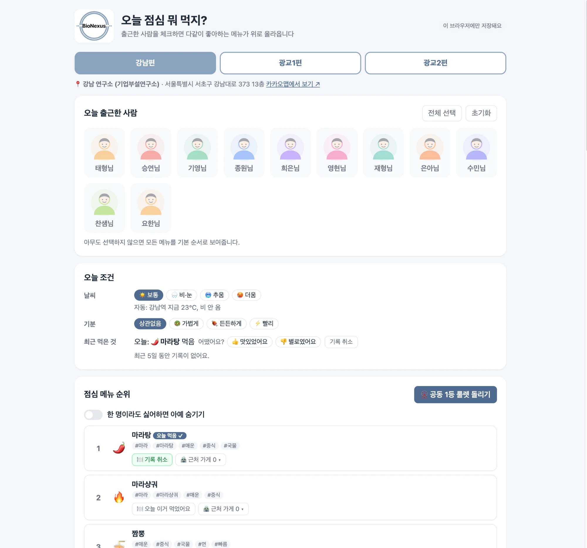

# BioNexus 점심 고르기

출근한 사람을 체크하면 그 사람들이 좋아하는 메뉴는 위로, 싫어하는 메뉴는 아래로 정렬해 주는 웹 페이지입니다.
Claude Code(AI 코딩 에이전트)로 개발했고, 카카오맵 API로 사무실 근처 식당을 찾아 줍니다.

👉 **바로 사용하기: https://andrew010417.github.io/what_lunch_do_you_want/**

## 저장소
| 위치 | 주소 |
|---|---|
| 웹페이지 (GitHub Pages) | https://andrew010417.github.io/what_lunch_do_you_want/ |
| GitHub | https://github.com/andrew010417/what_lunch_do_you_want |
| 사내 GitLab | https://gitlab.bionexus.co.kr/bionexus-enterprise/edu/onboarding_1th/what_lunch_do_you_want |

## 사무실
| 탭 | 위치 | 주소 |
|---|---|---|
| 강남편 | 강남 연구소 (기업부설연구소) | 서울특별시 서초구 강남대로 373 13층 |
| 광교1편 | 수원 본사 | 경기도 수원시 영통구 광교로 156 1104호, 광교비즈니스센터 |
| 광교2편 | 광교 기업부설연구소2 | 경기도 수원시 영통구 광교로 107 경기도경제과학진흥원 창업보육동 311호 |

## 사용한 기술
- HTML / CSS / JavaScript (빌드 도구 없음)
- 카카오맵 JavaScript API: 주소 → 좌표, 근처 식당 검색, 지도 핀
- Open-Meteo: 사무실 위치의 현재 날씨
- Supabase (선택): 기록 공유 저장소

## 기능
- 출근한 사람 체크 → 메뉴 순위 정렬 (좋아하는 사람 1명당 +1, 싫어하는 사람 1명당 -1)
- 한 명이라도 싫어하면 아예 숨기기 모드
- 사람을 누르면 그 사람의 취향 카드, "취향 수정"으로 직접 편집
- 오늘 먹은 메뉴 기록 → 최근 5일 안에 먹은 메뉴는 -1
- 메뉴별 근처 가게 등록 (이름, 도보 시간, 가격) + 카카오맵/네이버 지도 검색 링크
- 카카오맵으로 사무실 반경 1km 가게 자동 검색 + 지도 핀 표시 → "우리 가게로 저장"
- 먹은 뒤 가게 선택·👍/👎 평가 → 평가가 좋은 메뉴 +1, 별로인 메뉴 -1
- 날씨 반영: 비·눈/추움이면 #국물 +1, 더우면 #시원 +1 (자동 조회 실패 시 직접 선택)
- 기분 필터: 가볍게(#가벼움) / 든든하게(#든든) / 빨리(#빠름) +1
- 공동 1등 룰렛

## 실행
빌드 없이 `index.html`을 브라우저에서 열면 됩니다.
`data.js`에 Supabase 키를 넣으면 취향·기록·가게·평가가 모두와 실시간 공유되고, 비워 두면 그 브라우저에만 저장됩니다.

## 데이터 수정
`data.js`에서 메뉴(`MENUS`)와 사람별 기본 취향(`OFFICES.gangnam.people`)을 고칠 수 있습니다.
페이지에서 "취향 수정"으로 저장한 값이 있으면 그 값이 기본값보다 우선합니다.
광교1·광교2는 `people`을 채우면 바로 활성화됩니다.

## 카카오맵 설정
1. https://developers.kakao.com → 내 애플리케이션 → 애플리케이션 추가
2. 앱 키의 **JavaScript 키**를 `data.js`의 `KAKAO_JS_KEY`에 넣기 (또는 페이지에서 직접 입력)
3. [플랫폼 → Web]에 사이트 도메인 등록: `https://andrew010417.github.io`
4. 카카오맵 사용 설정(ON)이 필요하면 [제품 설정 → 카카오맵]에서 켜기

claude.ai 링크 안에서는 보안 정책 때문에 카카오맵 검색이 동작하지 않습니다. GitHub Pages 주소에서 사용하세요.

## Supabase 설정 (공유 저장)
1. https://supabase.com 에서 New project (Region: Northeast Asia (Seoul))
2. SQL Editor → New query → `supabase.sql` 내용을 붙여 넣고 Run
3. Project Settings → API (Data API) 에서 **Project URL**과 **anon / publishable 키**를 `data.js`의 `SUPABASE_URL`, `SUPABASE_ANON_KEY`에 넣기
   - `service_role` / `secret` 키는 절대 넣지 마세요.
